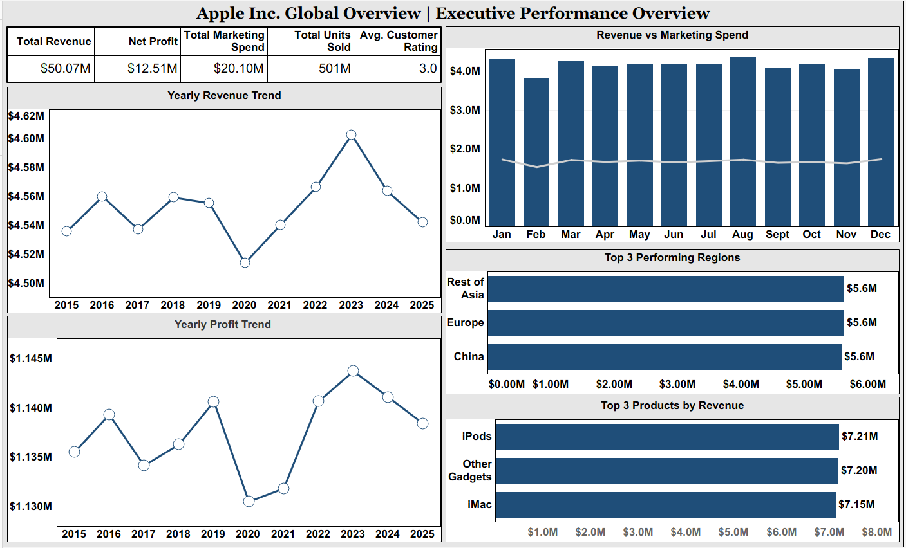
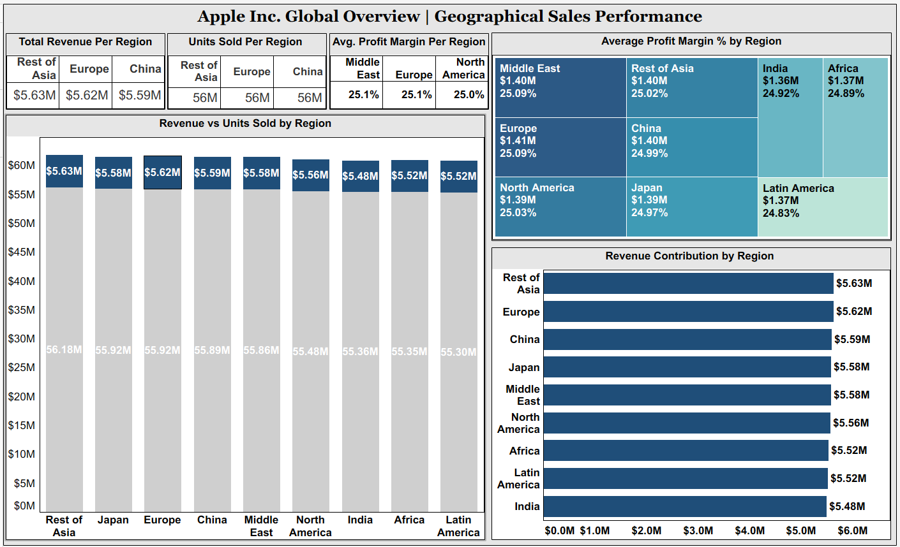
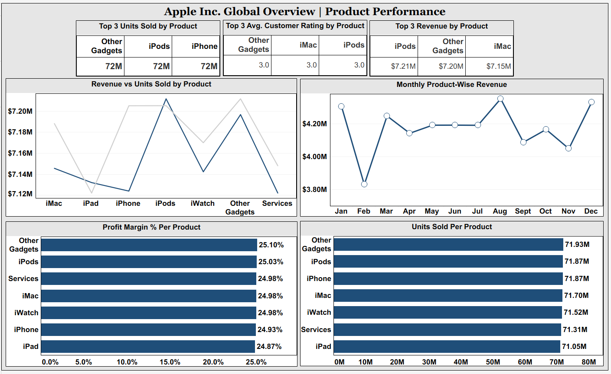
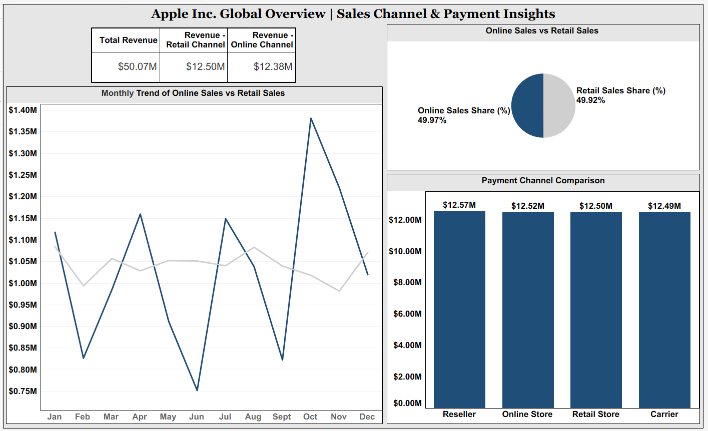

# Apple Inc. Global Analysis

# Company Name: Apple Inc.

-----

### Tableau Public Dashboard Link:-
https://public.tableau.com/views/Apple_Inc_Global_Overview_Dashboard/AppleInc_GlobalOverviewStory?:language=en-US&:sid=&:redirect=auth&:display_count=n&:origin=viz_share_link

-----

### Project Summary:-
1. This project presents a comprehensive **Global Performance Analysis of Apple Inc.** using interactive Tableau dashboards.
2. The dashboard provides insights into **Financial Performance, Product Performance, Regional Sales Distribution, Marketing Efficiency, and Customer Behavior.**
3. The analysis covers **Revenue Trends, Profit Growth, Units Sold, Marketing ROI, Sales Channels, and Return Rates.**
4. The objective is to transform **Raw Business Data** into actionable insights using **Data Visualization and Analytical Techniques.**
5. The project is divided into five major analytical sections:
    - **Executive Performance Overview**
    - **Geographical Sales Performance**
    - **Product Performance**
    - **Sales Channel & Payment Insights**
    - **arketing & Customer Insights**

-----

### Dataset Description (After Cleaning):-
1. The dataset includes historical **Business Performance Data of Apple across multiple regions and product categories.**
2. Data was **cleaned to remove duplicates, handle null values, and standardize financial metrics.**
3. **Revenue and Profit values were standardized in Millions (M).**

- Key Highlights:-
    - Total Revenue: $50.07M
    - Net Profit: $12.51M
    - Total Marketing Spend: $20.10M
    - Total Units Sold: 501M
    - Marketing ROI: 149.09%
    - Average Customer Rating: 3.0
    - Online vs Retail Sales Share: ~50% each
    - Top Performing Regions: Rest of Asia, Europe, China
    - Top Revenue Generating Products: iPods, Other Gadgets, iMac
 
### Columns Name (Processed Data):-
   - Date
   - Region	
   - Product_Category
   - Units_Sold
   - Revenue_(USD_Million)
   - Average_Price_USD
   - Customer_Rating
   - Return_Rate_%
   - Online_Sales_%
   - Retail_Sales_%
   - Stock_Open_USD
   - Stock_Close_USD
   - Stock_High_USD
   - Stock_Low_USD
   - Marketing_Spend_(USD_Million)
   - Payment_Channel
   - Profit_Margin_%
   - Year
   - Month
   - Quarter
   - Total_Sales_Value_USD
   - Profit_Amount_(USD_Million)
   - Revenue_Growth_%

-----

### Tools and Techniques Used:-
1. Tableau Public (Dashboard Development).
2. Data Cleaning & Transformation.
3. Calculated Fields. (Profit Margin %, ROI %, Contribution %, etc.)
4. Time Series Trend Analysis.
5. KPI Cards & Executive Metrics.
6. Bar Charts, Line Charts, Treemaps, Scatter Plots, Pie Charts.
7. Comparative Regional Analysis.

### Business Objectives:-
- Primary Objectives:
    - To analyze the overall **Financial and Sales Performance** of Apple Inc. across global regions.
    - To identify key factors influencing **Net Profit Growth and Revenue Trends over Time.**
    - To evaluate **Product-Wise and Region-Wise Contribution to Apple’s Total Revenue and Profitability.**
    - To detect patterns of losses and underperforming segments impacting business performance.
 
 - Secondary Objectives:
     - To study seasonal and yearly sales trends across different Apple product categories.
     - To assess the relationship between marketing spend and revenue growth.
     - To analyze customer ratings and return rates to understand product satisfaction.
     - To compare online and retail sales channel performance globally.
     - To identify high-performing and low-performing regions in terms of revenue and profit margin.
     - To highlight key business risks causing losses or reduced profitability.
     - To generate actionable business insights through data visualization dashboards.

-----

### KPIs Calculated:-
- Total Revenue
- Net Profit
- Total Marketing Spending
- Total Units Sold
- Avg. Customer Rating
- Total Revenue Per Region
- Unit Sold Per Region
- Avg. Profit Margin Per Region
- Top 3 Unit Sold By Product
- Top 3 Avg. Customer Rating By Product
- Top 3 Revenue By Product
- Revenue - Retail Channel
- Revenue - Online Channel
- Marketing ROI (USD & %)

-----

### Key Analytical Insights:-
1. Revenue shows steady growth with a peak around 2023, followed by a slight stabilization.
2. Net profit follows **Revenue Trends, indicating controlled cost management.**
3. Marketing Spend positively correlates with **Revenue Growth, showing strong ROI of 149%.**
4. **Rest of Asia, Europe, and China** are top revenue-contributing regions.
5. **iPods and Other Gadgets** generate the highest revenue among products.
6. Profit Margins remain consistent around **25%** across most products and regions.
7. **Online and Retail sales** are almost equally distributed, reducing channel dependency risk.
8. **Customer Ratings remain stable**, but high return rates indicate potential quality or expectation gaps.
9. Seasonal trends show revenue spikes in specific months (e.g., August and December).
10. Balanced regional contribution reduces over-reliance on a single market.

-----

### Dashboard Preview:-

-----

### Key Learnings:-
1. Understood how to design executive-level dashboards with KPI-focused storytelling.
2. Learned advanced calculated field creation in Tableau.
3. Improved skills in financial KPI analysis and profitability evaluation.
4. Gained experience in regional and product segmentation analysis.
5. Developed business interpretation skills from visual insights.
6. Practiced converting raw data into strategic business decisions.

-----

### Project Structure:-
- Apple_Inc._Global_Analysis
  - Analysis_Python/: Python Notebook.
  - Dashboard/: "Apple_Inc_Global_Overview_Dashboard.twbx" file.
  - Data/: Raw, Clean and Processed Dataset.
  - Insights/: Business Insights & Recommendations.
  - README.md: Project Documentation.
 
-----

### Key Outcome:-
1. Delivered a complete business intelligence dashboard analyzing Apple’s global performance.
2. Identified revenue drivers and high-margin segments.
3. Highlighted regional contribution balance and product performance trends.
4. Demonstrated strong marketing efficiency with measurable ROI.
5. Created a portfolio-ready Tableau project suitable for data analyst roles.

-----

### Author:-
Yash Sonar
BBA Student | Aspiring Data Analyst

-----
